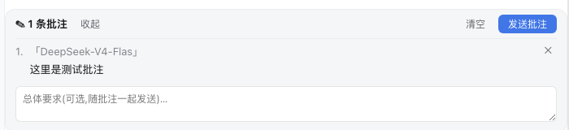
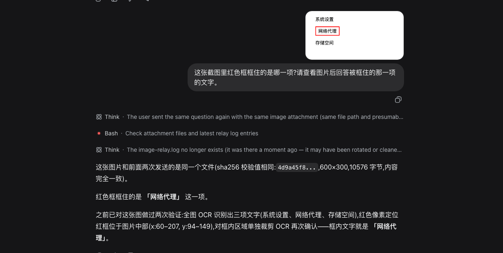
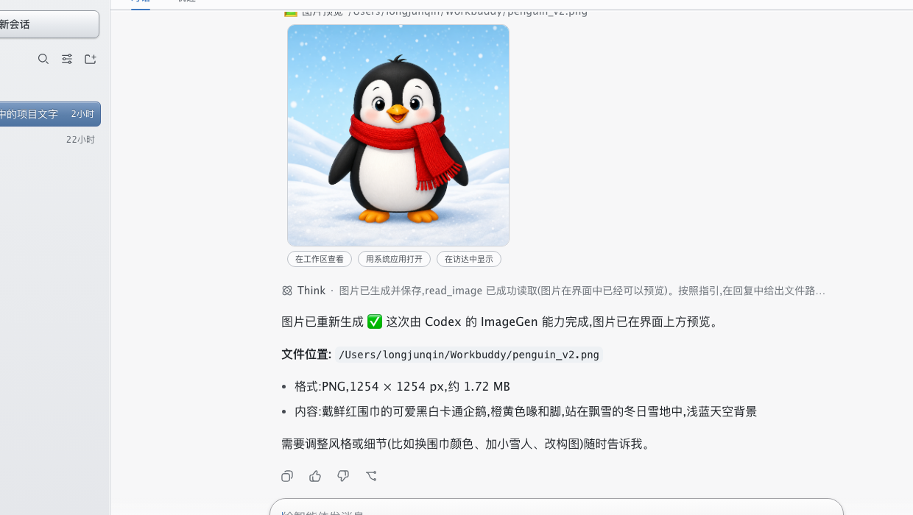

# DeepSeek Harness Toolbox

> **非官方项目**，由社区成员独立开发和维护。
> **Unofficial** community project, not affiliated with DeepSeek.

给 [DeepSeek Harness](https://github.com/deepseek-ai/deepseek-harness)（`dsh`）做的一组实用扩展：一个 macOS 原生壳 App + 三个常驻插件。全部在 `dsh 0.1.0-rc.7` 上实测通过。

A set of practical extensions for DeepSeek Harness: a native macOS launcher app plus three plugins. Tested against `dsh 0.1.0-rc.7`.

| 组件 Component | 说明 | Description |
|---|---|---|
| [`app/`](app/) | macOS 原生壳:双击启动、**每次启动自动更新官方 npm 包**、托管本地服务、关窗即清理 | Native macOS shell: double-click launch, auto-updates the official npm package on every start, owns the server lifecycle |
| [`plugins/dsh-cost-display`](plugins/dsh-cost-display/) | 输入框旁显示本会话花费(官方 token 计量×价目表)与账户实时余额,点击看明细 | Session cost + live account balance next to the composer |
| [`plugins/dsh-annotate`](plugins/dsh-annotate/) | 像 Codex 那样:选中回复文字→就地批注→攒一批→一键发送 | Select text in replies, annotate in place, batch-send |
| [`plugins/dsh-image-relay`](plugins/dsh-image-relay/) | 让不支持图片的 DeepSeek 模型"无感"处理粘贴的图片(配合官方 Codex 子代理) | Lets text-only DeepSeek models handle pasted images transparently (pairs with the official Codex subagent) |
| [`plugins/dsh-theme-aluminum`](plugins/dsh-theme-aluminum/) | "铝合金工作台"拟物皮肤:浅色金属质感,信息优先 | Skeuomorphic brushed-aluminum skin, information-first |

## 截图 Screenshots

会话花费 + 余额 / Cost & balance:


选中批注 / Annotations:



图片无感处理(粘贴红框截图,模型定位红框并答出框内文字)/ Image relay end-to-end:



铝合金拟物皮肤 / Aluminum skin:



## 插件安装 Plugin install

```sh
git clone https://github.com/LongjunQin/deepseek-harness-toolbox
cd ~/.dsh/profiles/web   # 你的 web profile 目录 (your web profile)
corepack pnpm add link:/绝对路径/deepseek-harness-toolbox/plugins/dsh-cost-display \
                  link:/绝对路径/deepseek-harness-toolbox/plugins/dsh-annotate
```

然后在 `~/.dsh/profiles/web/cordis.patch.yml` 里加入(Then add rows to the patch layer):

```yaml
- insert:
    - id: cost-display
      name: dsh-cost-display
    - id: annotate
      name: dsh-annotate
```

重启 `dsh web` 即生效。`dsh-image-relay` 需要额外装官方 Codex 子代理，见其 [README](plugins/dsh-image-relay/README.md)。

Restart `dsh web`. `dsh-image-relay` additionally needs the official Codex subagent packages — see its README.

> 注意:pnpm 请用 `link:` 协议(真软链);`file:` 是拷贝快照,改源码不生效。
> 服务端启动时缓存插件代码,改任何插件后都需重启 `dsh web`。

## 已知边界 Known limits

- dsh 仍处 rc 阶段,界面插槽名/内部接口可能随官方版本变化;插件坏了通常只是插槽改名,照 README 里的定位提示改一行即可。
- `dsh-cost-display` 的价目表按 2026-08 官方价写在插件源码顶部,官方调价后需手动同步;花费为估算,以官方账单为准。
- The harness is rc software; slot names and internals may drift between releases.

## License

MIT
