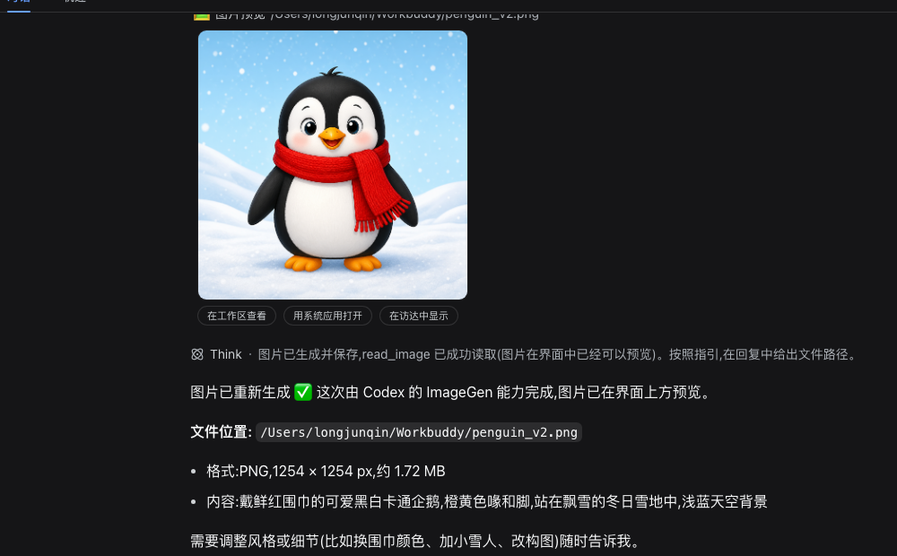

# dsh-image-relay

> 非官方插件 / Unofficial plugin.

DeepSeek 对话模型不接受图片输入——本插件让你在 harness 里**照常粘贴图片**,
模型"无感"地看懂它:配合官方 `dsh-subagent-codex`,把视觉工作交给本机 Codex CLI
(或让模型用自己的工具自行分析)。

Text-only DeepSeek models reject pasted images. This plugin makes pasted images
"just work": it admits them, exports them to local files, and steers the model
to inspect them via the official Codex subagent (or its own tools).


## 2026-08-18 新增:生图 + 界面预览

- **生图指引**(宿主):经官方 `systemPrompt.section` 注入常驻提示词——图片生成
  一律派 `subagent_codex` 用 Codex 的 ImageGen 能力(用户明确要程序绘图除外),
  产出后调用 `read_image` 给用户预览。
- **图片卡**(浏览器):接管 `read_image` 的工具卡(`tool.call.toolview`,
  key=read_image)——图片直接渲染在对话里,点击放大,并带三个按钮:
  在工作区查看 / 用系统应用打开 / 在访达中显示(macOS,经宿主路由执行 `open`)。
  历史消息里的 read_image 也会追溯渲染。

Adds Codex ImageGen steering (system prompt section) and an inline image card
for `read_image` results: rendered preview, click-to-zoom, and open-in-app /
reveal-in-Finder buttons.



## 工作原理 How it works

1. **放行发送准入**:harness 按 `resolveModelInfo().inputModalities` 在发送时
   拒图(DeepSeek 适配器写死 `["text"]`);本插件运行时补上 `"image"` 声明,
   图片可正常发送并显示在会话里。
2. **请求前替换**:在官方 `llm/stream` 瀑布事件拦截,把图片块导出为
   `~/.dsh/image-inbox/<sha256 前 16 位>.<ext>`(内容寻址缓存),替换成文字指引:
   图在哪个路径、需要看图就调用 `subagent_codex`。适配器永远收不到图片块。
3. **工具结果同样处理**:`read_image` 等工具返回的嵌套图片一并替换
   (与适配器 `contentHasImage` 的递归口径一致)。

会话快照深度冻结,故采用"克隆替换 + 经 `ctx.llm.stream` 重新派发";
无图请求直接放行,不递归。

## 安装 Install

**Codex 是可选的。** 插件启动时自动探测本机有没有 `codex` CLI:

- **有** → 完整体验:看图/生图派 Codex(视觉 + ImageGen);
- **没有** → 自动降级:图片照样能粘贴、落盘、界面预览,指引改为让模型用
  自带工具自行分析(像素/OCR),生图退回代码绘图。不装 Codex 不会报错。

Codex is optional: the plugin detects the `codex` CLI at startup and adapts.
Without it, images still paste/persist/preview; the model analyzes files with
its own tools instead of delegating.

### 基础安装(无 Codex)Basic

```sh
cd ~/.dsh/profiles/web
corepack pnpm add link:/path/to/deepseek-harness-toolbox/plugins/dsh-image-relay
```

`cordis.patch.yml` 只加一行:

```yaml
- insert:
    - id: image-relay
      name: dsh-image-relay
```

### 完整安装(有 Codex)Full

在基础安装之上,再装官方 Codex 子代理(要求本机 `codex` CLI 已装且已登录):

```sh
cd ~/.dsh/profiles/web
DSH_NM=$(dirname $(dirname $(readlink -f $(command -v dsh))))/node_modules/@deepseek-ai
corepack pnpm add link:/path/to/deepseek-harness-toolbox/plugins/dsh-image-relay \
  @deepseek-ai/dsh-subagent-codex @deepseek-ai/dsh-sdk-protocol \
  link:$DSH_NM/dsh-invariants link:$DSH_NM/dsh-session link:$DSH_NM/dsh-llm \
  link:$DSH_NM/dsh-subagent link:$DSH_NM/dsh-subprocess link:$DSH_NM/dsh-timeout \
  link:$DSH_NM/cordis
```

(`dsh-subagent-codex@0.0.1-rc.1` 的 peer 依赖需软链到 dsh 安装目录里的同名包,
避免装出重复实例;`dsh-sdk-protocol` 单独从 npm 装。)

`cordis.patch.yml`:

```yaml
- insert:
    - id: subagent-codex
      name: '@deepseek-ai/dsh-subagent-codex'
    - id: tool-subagent-codex
      name: '@deepseek-ai/dsh-tool-subagent'
      config:
        provider: codex
        toolName: subagent_codex
        enableRunInBackground: false
        maxDepth: provider-managed
    - id: image-relay
      name: dsh-image-relay
```

重启 `dsh web`。Restart `dsh web`.

## 已验证 Verified

端到端:粘贴一张"红框圈住菜单项"的截图并提问 → 发送放行 → 图片落盘 →
模型自主分析(红色像素定位+裁剪 OCR)或派 Codex → 正确答出框内文字,全程无感。

## 已知边界 Known limits

- 看图深度取决于模型选的路径;艺术类图片建议在提问里明说"让 codex 看/画";
- `~/.dsh/image-inbox/` 可随时清空(自动重建);
- 官方将来原生支持视觉模型时,删除 image-relay 行即可回到原生行为;
- Codex 子代理走你本机的 Codex 登录与订阅额度。
